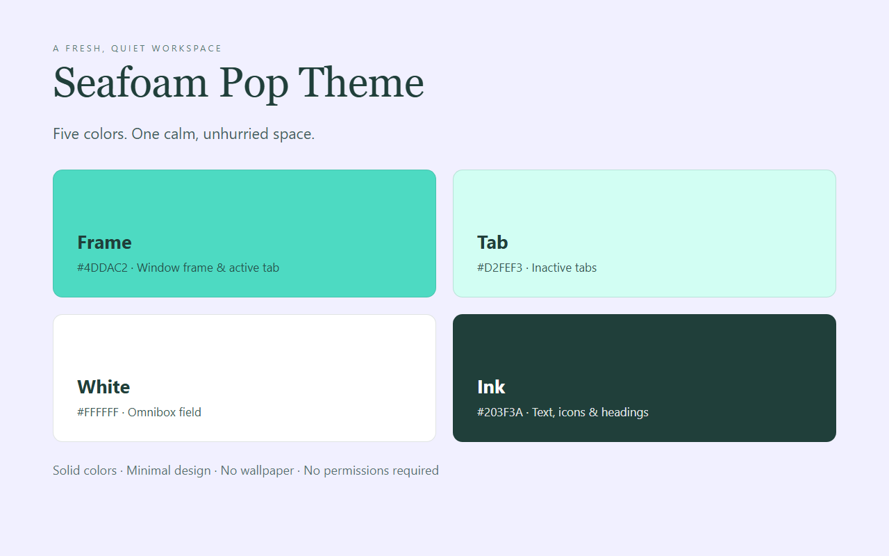

<p align="center">
  
</p>

<h1 align="center">Seafoam Pop Theme</h1>

<p align="center">A soft, light Chrome theme for calm, unhurried browsing.</p>

<p align="center">
  
  
  
</p>

## About

Seafoam Pop brings a fresh, quiet surface to your browser. A seafoam green window frame wraps a pale mint tab strip, and a gentle lavender-white toolbar sits under it, so the browser feels airy without ever competing with the pages you open. Deep teal ink carries every label and icon, which keeps text readable on all of those light surfaces. The design is pure solid colour — no wallpaper, no textures, no gradients — for a clean, distraction-free workspace.

## Color Palette

| Token | Hex | Usage |
|-------|-----|-------|
| Seafoam | `#4DDAC2` | Window frame and active tab |
| Pale Mint | `#D2FEF3` | Inactive tabs, buttons, new-tab page accents |
| Lavender White | `#F1F0FF` | Toolbar and new-tab page background |
| Deep Teal | `#203F3A` | Tab, toolbar, omnibox and new-tab text |
| Muted Teal | `#5B7C77` | Toolbar icons, bookmark and secondary text |
| White | `#FFFFFF` | Omnibox (address bar) field |

## Features

- Fresh seafoam + mint + lavender-white palette with a calm, coastal feel.
- Solid colour design with no images, textures, or gradients for a lightweight look.
- Deep teal text tuned for contrast on every light surface, including the omnibox.
- Matching incognito colours.
- Clean, distraction-free new-tab page.
- Pure theme: no scripts, no permissions, nothing collected.

## Install

### From source (unpacked)

1. Download or clone this repository.
2. Open Chrome and navigate to `chrome://extensions`.
3. Enable **Developer mode** in the top-right corner.
4. Click **Load unpacked** and select this folder.

### From Chrome Web Store

Search for **Seafoam Pop Theme** in the Chrome Web Store and install it.

## Preview




## Files

| File | Description |
|------|-------------|
| `manifest.json` | Chrome theme manifest (MV3) with inline `theme` config — single source of truth for every colour |
| `logo/logo.png` | Chrome Web Store icon (128x128) |
| `store-assets/screenshots/en/` | Store listing screenshots (1280x800) |
| `store-assets/promo/` | Promo tiles (440x280 and 1400x560) |
| `store-assets/references/` | HTML illustrations plus their PNG renders |
| `store-assets/store-description.txt` | Store listing detailed description (English) |
| `scripts/` | Generators: logo, promo, screenshots, upload zip |

## Packaging

```
python3 scripts/package-zip.py
```

Writes `dist/seafoam-pop-theme-<version>.zip` containing only `manifest.json` and `logo/logo.png`, and copies it to the default upload folder.

## License

Non-Commercial License — personal use permitted, commercial use requires permission. See [LICENSE](LICENSE).
