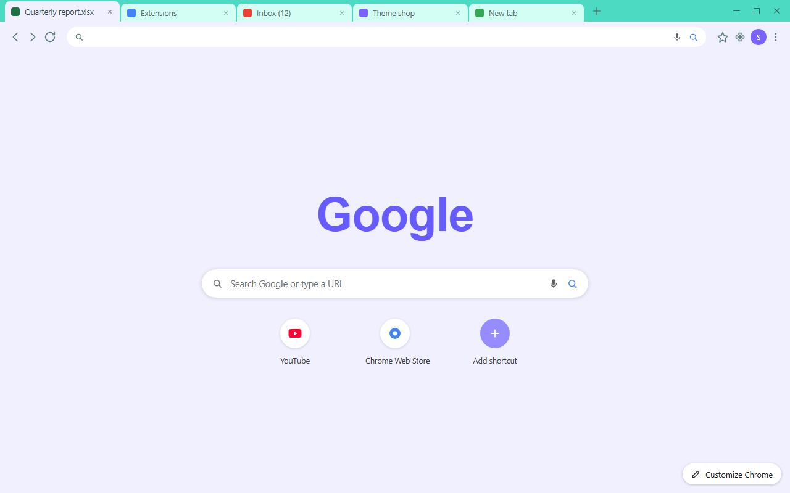

# Seafoam Pop Theme

A soft, light Chrome theme for calm, unhurried browsing.

<p align="center">
  
</p>



## Design

Seafoam Pop keeps the browser quiet so the pages you open stay in front. A fresh
seafoam green frame wraps a pale mint tab strip and a gentle lavender-white
toolbar, and every piece of text sits in a deep teal ink that holds its contrast
on all of those light surfaces.

There is no wallpaper, no gradient noise and no busy texture — just five flat
colours that were picked to work together and to stay readable in dark rooms and
bright ones.

## Palette

| Role | Colour | Hex |
| --- | --- | --- |
| Frame | seafoam | `#4DDAC2` |
| Inactive tab | pale mint | `#D2FEF3` |
| Toolbar / active tab | lavender white | `#F1F0FF` |
| Ink (tabs, omnibox, new tab text) | deep teal | `#203F3A` |
| Secondary text and toolbar icons | muted teal | `#5B7C77` |
| Omnibox field | white | `#FFFFFF` |
| New tab page | lavender white | `#F1F0FF` |

## Features

- Cohesive light palette across frame, tabs, toolbar, omnibox, bookmarks and the new tab page
- Deep teal text tuned for contrast on every light surface
- Matching incognito colours
- Pure flat colour — no background image, no pattern
- 128 px icon included

## Install

From the Chrome Web Store: search for **Seafoam Pop** and click *Add to Chrome*.

Manually, for development:

1. Open `chrome://extensions`
2. Turn on **Developer mode**
3. Click **Load unpacked** and select this folder
4. The theme applies immediately

## Packaging

```
python3 scripts/package-zip.py
```

Writes `dist/seafoam-pop-theme-<version>.zip` with only `manifest.json` and
`logo/logo.png`, and copies it to the default output folder for upload.

## Files

| Path | What it is |
| --- | --- |
| `manifest.json` | The theme definition and the single source of truth for every colour |
| `logo/logo.png` | 128 px store icon |
| `store-assets/promo/` | 440×280 promo tile and 1400×560 marquee |
| `store-assets/screenshots/` | 1280×800 store screenshot |
| `store-assets/store-description.txt` | Chrome Web Store description |
| `scripts/generate-logo.py` | Redraws the icon from the manifest palette |
| `scripts/generate-promo.py` | Redraws the promo tiles and the description |
| `scripts/generate-screenshot.py` | Headless browser render of the store screenshot |
| `scripts/package-zip.py` | Builds and copies the upload zip |

Every asset is generated from `manifest.json`, so changing a colour there and
re-running the scripts keeps the theme, the icon and the store art in sync.

## License

Non-commercial use only — see [LICENSE](LICENSE).
